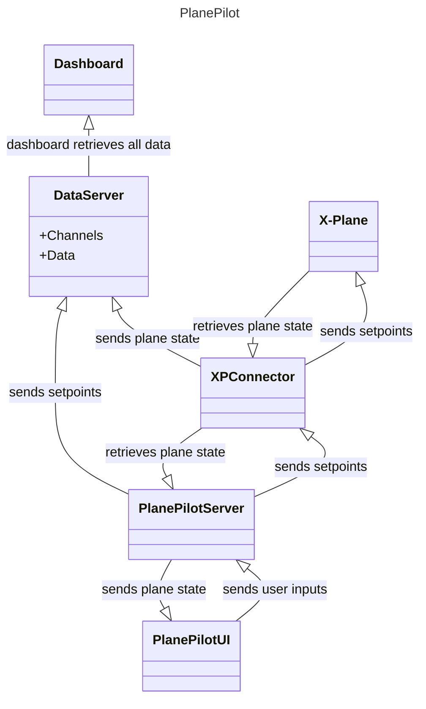

# planepilot
xplane11 logger and (future) autopilot

```mermaid
---
title: PlanePilot
---
classDiagram
    DataServer <|-- XPConnector : sends plane state
    Dashboard <|-- DataServer : dashboard retrieves all data
    PlanePilotServer <|-- PlanePilotUI : sends user inputs
    PlanePilotServer --|> PlanePilotUI : sends plane state
    XPConnector <|-- PlanePilotServer : sends setpoints
    XPConnector --|> PlanePilotServer : retrieves plane state
    DataServer <|-- PlanePilotServer : sends setpoints
    X-Plane <|-- XPConnector : sends setpoints
    X-Plane --|> XPConnector : retrieves plane state
    class DataServer{
        +Channels
        +Data
    }
    class Dashboard {

    }
    class PlanePilotServer{

    }
    class PlanePilotUI {

    }
    class X-Plane {

    }
```

## Tech stack

### UI
* React
  * Redux Saga
  * Rechart

###  Dataserver
* Rust
  * Tokio async
  * Axum
  * Sqlx (sqlite)
