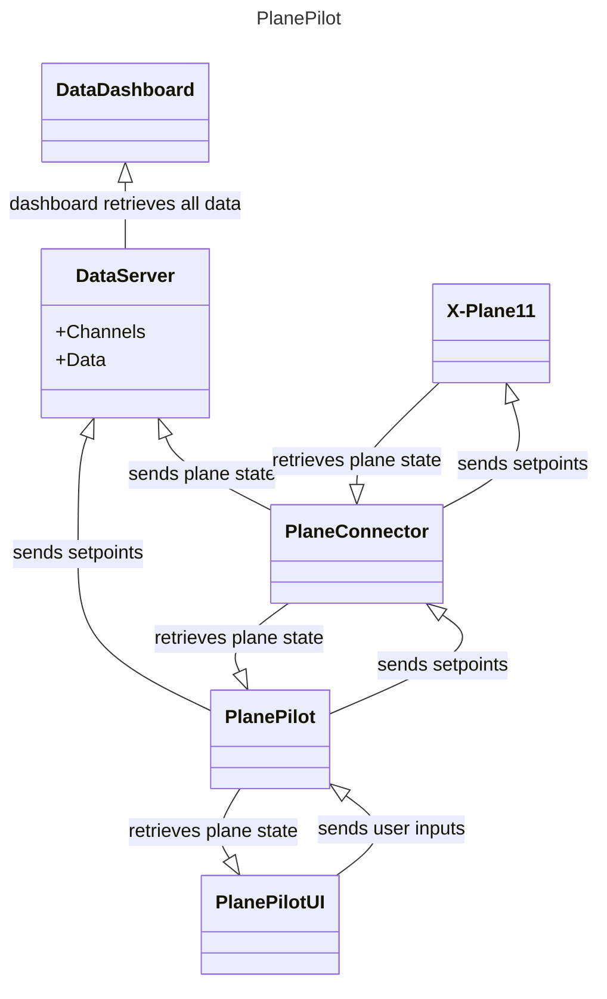

# planepilot
xplane11 logger and (future) autopilot

## Tech stack

### PlaneConnector
* Rust
  * Tokio async
  * UDP sockets   

### DataDashboard
* React
  * Redux Saga
  * Rechart

###  Dataserver
* Rust
  * Tokio async
  * Axum
  * Sqlx (sqlite)
